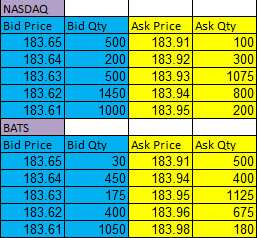
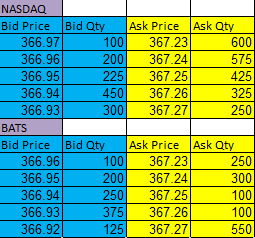
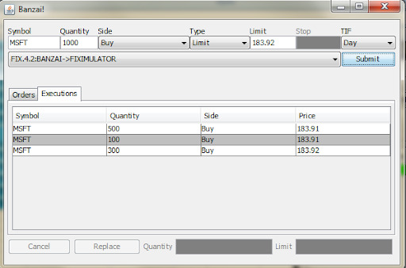
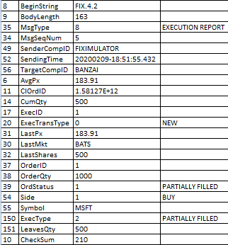
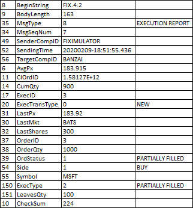

# Bloomberg-Project

For my Bloomberg project, I decided to build a smart order router. Essentially, my application takes in both bid and ask orders from a Banzai client and finds the most profitable way to execute these orders. For the purpose of the demo, my algorithm reads level 2 market data in an Excel spreadsheet before carrying out the order; the spreadsheet contains the bids and asks for MSFT(Microsoft) and NFLX(Netflix) across two exchanges(BATS and NASDAQ). By reading through this data, I am able to then organize it into an orderbook.
On the client-side, the Banzai GUI takes in information about the type and quantity of the stock order as well as its side and time in force before sending the information via FIX to my program. After piecing apart the FIX message and iterating through my order book in order to find the best possible execution, my program returns an execution report to the Banzai client, which is displayed on the GUI. 

*Attached below are data tables as well as screenshots of a sample buy order of 1000 shares of Microsoft. 

Microsoft:

Netflix:

Sample Buy Order(1000 shares of Microsoft):

Buy Order(FIX):
.png)

Execution #1(FIX)

Execution #2(FIX)

Execution #3(FIX)

